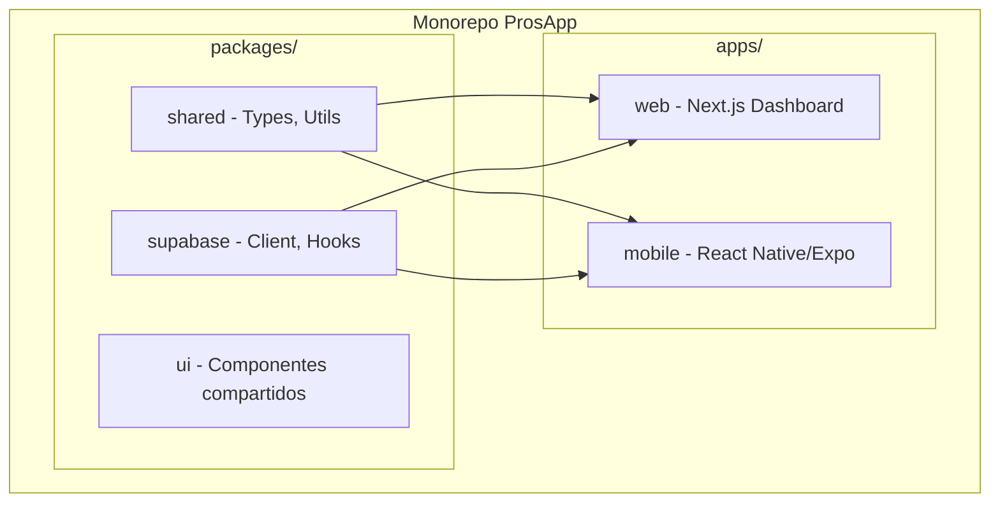

# Monorepo: Next.js Web + React Native Mobile

## Arquitectura Propuesta



## Estructura de Carpetas Final

```
pros-monorepo/
├── apps/
│   ├── web/                    # Next.js 14 (App Router)
│   │   ├── app/
│   │   │   ├── (auth)/        # Login
│   │   │   ├── (dashboard)/   # Admin/User layouts
│   │   │   │   ├── eventos/
│   │   │   │   ├── usuarios/
│   │   │   │   └── estadisticas/
│   │   │   └── layout.tsx
│   │   ├── components/        # Componentes web específicos
│   │   └── package.json
│   │
│   └── mobile/                 # React Native (ProsApp actual)
│       ├── app/               # Expo Router
│       ├── components/        # Componentes mobile
│       └── package.json
│
├── packages/
│   ├── shared/                # Código compartido
│   │   ├── types/            # TypeScript types
│   │   ├── utils/            # Helpers, validaciones
│   │   └── constants/        # Temas, configuración
│   │
│   └── supabase/             # Cliente y hooks de Supabase
│       ├── client.ts
│       ├── hooks/
│       └── queries/
│
├── turbo.json
└── package.json
```

---

## Fase 1: Setup del Monorepo

1. Crear estructura base con Turborepo
2. Configurar npm workspaces
3. Mover ProsApp actual a `apps/mobile`
4. Extraer código compartido a `packages/`

---

## Fase 2: App Web con Next.js

### Layout Dashboard (Web)

- **Sidebar fijo** con navegación principal (Eventos, Usuarios, Estadísticas)
- **Header** con perfil de usuario y logout
- **Área principal** con contenido responsive
- **Tema oscuro/claro** toggle

### Páginas Web

| Ruta | Descripción |

|------|-------------|

| `/login` | Autenticación |

| `/dashboard` | Vista general con stats |

| `/eventos` | Tabla de eventos con filtros, búsqueda, paginación |

| `/eventos/[id]` | Detalle/edición de evento |

| `/eventos/crear` | Formulario creación |

| `/usuarios` | Gestión de usuarios (tabla) |

| `/estadisticas` | Gráficos y reportes |

### Componentes Web Específicos

- `DataTable` - Tabla con sorting, filtros, paginación
- `Sidebar` - Navegación lateral colapsable
- `Charts` - Gráficos con Recharts o Chart.js
- `Modal` - Modales para formularios
- `DateRangePicker` - Selector de rango de fechas

---

## Fase 3: Mejoras Mobile

### Fixes de Responsividad

1. **KeyboardAvoidingView mejorado** - Wrapper consistente para todos los formularios
2. **ScrollView con `keyboardShouldPersistTaps="handled"`** - Ya existe pero verificar en todas las pantallas
3. **`useKeyboard` hook** - Detectar teclado abierto y ajustar layout
4. **Safe Area** - Consistencia en todos los screens

### Componentes Mobile Mejorados

- Input con mejor manejo de focus y scroll automático
- Formularios que se ajustan al teclado
- Bottom sheets en lugar de modales que bloquean

---

## Dependencias Clave

### Web (Next.js)

```json
{
  "next": "14.x",
  "react": "18.x",
  "@supabase/ssr": "latest",
  "tailwindcss": "3.x",
  "shadcn/ui": "components",
  "recharts": "2.x",
  "@tanstack/react-table": "8.x"
}
```

### Compartido

```json
{
  "@supabase/supabase-js": "2.x",
  "zod": "3.x"
}
```

---

## Archivos Clave a Crear/Modificar

### Configuración Monorepo

- `package.json` (root) - Workspaces config
- `turbo.json` - Pipeline de build
- `apps/web/package.json`
- `apps/mobile/package.json`
- `packages/shared/package.json`
- `packages/supabase/package.json`

### Paquete Compartido

- `packages/shared/types/index.ts` - Mover desde [ProsApp/lib/types.ts](ProsApp/lib/types.ts)
- `packages/supabase/client.ts` - Mover desde [ProsApp/lib/supabase.ts](ProsApp/lib/supabase.ts)
- `packages/supabase/hooks/useAuth.ts`
- `packages/supabase/hooks/useEvents.ts`

### App Web

- `apps/web/app/layout.tsx` - Root layout con providers
- `apps/web/app/(dashboard)/layout.tsx` - Dashboard con sidebar
- `apps/web/components/Sidebar.tsx`
- `apps/web/components/DataTable.tsx`

---

## Orden de Implementación

1. **Setup monorepo** - Estructura y configuración
2. **Migrar mobile** - Mover ProsApp sin romper funcionalidad
3. **Extraer shared** - Types, utils, supabase client
4. **Crear web base** - Next.js con auth
5. **Dashboard web** - Layout y navegación
6. **Páginas web** - Eventos, usuarios, estadísticas
7. **Polish mobile** - Fixes de keyboard y responsive